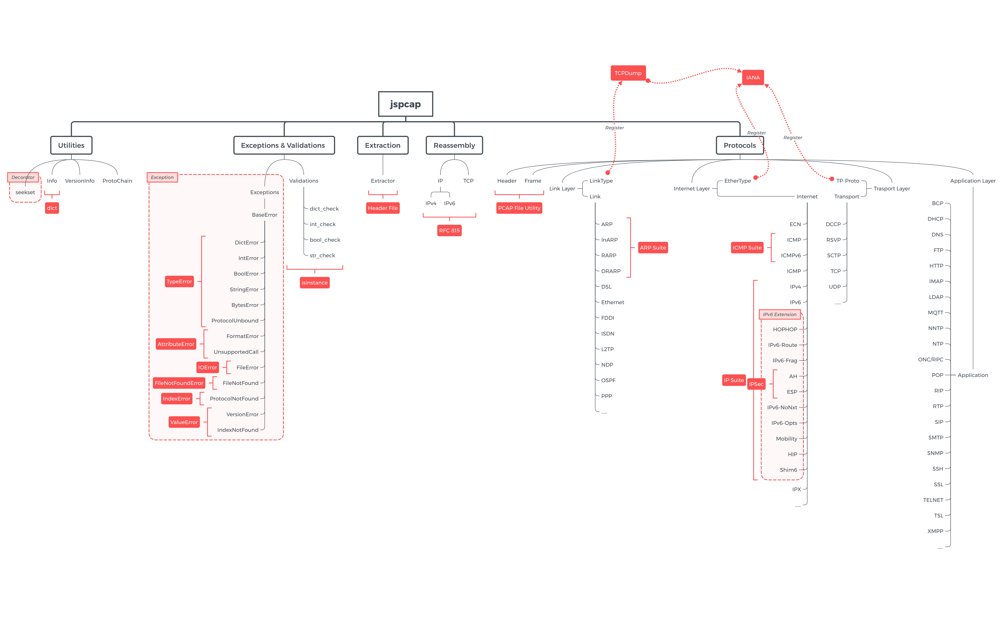

# jspcap

&emsp; The `jspcap` project is an open source Python program focus on [PCAP](https://en.wikipedia.org/wiki/Pcap) parsing and analysis, which works as a stream pcap file extractor. With support of [`jsformat`](https://github.com/JarryShaw/jsformat), it shall support multiple output report formats.

 > Note that the whole project only supports __Python 3.6__ or later.

 - [About](#about)
    * [Interface](https://github.com/JarryShaw/jspcap/tree/master/src#interface)
    * [Extraction](https://github.com/JarryShaw/jspcap/tree/master/src#extraction)
    * [Reassembly](https://github.com/JarryShaw/jspcap/tree/master/src/reassembly#reassembly-manual)
    * [Protocols](https://github.com/JarryShaw/jspcap/tree/master/src/protocols#protocols-manual)
    * [Utilities](https://github.com/JarryShaw/jspcap/tree/master/src#utilities)
    * [Exceptions](https://github.com/JarryShaw/jspcap/tree/master/src#exceptions)
 - [Installation](#installation)
 - [Usage](#usage)
    * [Documentation](#documentation)
        - [Interface](#interface)
        - [Macros](#macros)
        - [Protocols](#protocols)
    * [CLI Usage](#cli-usage)
 - [Samples](#samples)
    * [Usage Samples](#usage-samples)
    * [CLI Samples](#cli-samples)
 - [TODO](#todo)

---

## About

&emsp; `jspcap` is an independent open source library, using only [`jsformat`](https://github.com/JarryShaw/jsformat) as its formatted output dumper.

> There is a project called [`jspcapy`](https://github.com/JarryShaw/jspcapy) works on `jspcap`, which is a command line tool for PCAP extraction.

&emsp; Unlike popular PCAP file extractors, such as `Scapy`, `dkpt`, `pyshark`, and etc, `jspcap` uses __streaming__ strategy to read input files. That is to read frame by frame, decrease occupation on memory, as well as enhance efficiency in some way.

&emsp; In `jspcap`, all files can be described as following six parts.

 - Interface (`jspcap.interface`) -- user interface for the `jspcap` library, which standardises and simplifies the usage of this library
 - Extraction (`jspcap.extractor`) -- synthesise file I/O and protocol analysis, coordinate information exchange in all network layers
 - Reassembly (`jspcap.reassembly`) -- base on algorithms described in [`RFC 815`](https://tools.ietf.org/html/rfc815), implement datagram reassembly of IP and TCP packets
 - Protocls (`jspcap.protocols`) -- collection of all protocol family, with detailed implementation and methods
 - Utilities (`jspcap.utilities`) -- collection of four utility functions and classes
 - Exceptions (`jspcap.exceptions`) -- collection of refined custom exceptions



&nbsp;

## Installation

> Note that `jspcap` only supports Python verions __since 3.6__

&emsp; Simply run the following to install the latest from PyPI:

```
pip install jspcap
```

&emsp; Or install from the git repository:

```
$ git clone https://github.com/JarryShaw/jspcap.git
$ python setup.py install
```

&nbsp;

## Usage

### Documentation

##### Interface

|                                      NAME                                      |            DESCRIPTION            |
| :----------------------------------------------------------------------------: | :-------------------------------: |
| [`extract`](https://github.com/JarryShaw/jspcap/tree/master/src#extract)       |        extract a PCAP file        |
| [`analyse`](https://github.com/JarryShaw/jspcap/tree/master/src#analyse)       | analyse application layer packets |
| [`reassemble`](https://github.com/JarryShaw/jspcap/tree/master/src#reassemble) |  reassemble fragmented datagrams  |

##### Macros

|                                   NAME                                   |               DESCRIPTION                |
| :----------------------------------------------------------------------: | :--------------------------------------: |
| [`JSON`](https://github.com/JarryShaw/jspcap/tree/master/src#variables)  | JavaScript Object Notation (JSON) format |
| [`PLIST`](https://github.com/JarryShaw/jspcap/tree/master/src#variables) |    macOS Property List (PLIST) format    |
| [`TREE`](https://github.com/JarryShaw/jspcap/tree/master/src#variables)  |          Tree-View text format           |

##### Protocols

|                                                NAME                                               |             DESCRIPTION             |
| :-----------------------------------------------------------------------------------------------: | :---------------------------------: |
| [`Raw`](https://github.com/JarryShaw/jspcap/tree/master/src/protocols#raw)                        |           Raw Packet Data           |
| [`ARP`](https://github.com/JarryShaw/jspcap/tree/master/src/protocols/link#arp)                   |     Address Resolution Protocol     |
| [`Ethernet`](https://github.com/JarryShaw/jspcap/tree/master/src/protocols/link#ethernet)         |          Ethernet Protocol          |
| [`L2TP`](https://github.com/JarryShaw/jspcap/tree/master/src/protocols/link#l2tp)                 |    Layer Two Tunneling Protocol     |
| [`OSPF`](https://github.com/JarryShaw/jspcap/tree/master/src/protocols/link#ospf)                 |      Open Shortest Path First       |
| [`RARP`](https://github.com/JarryShaw/jspcap/tree/master/src/protocols/link#rarp)                 | Reverse Address Resolution Protocol |
| [`VLAN`](https://github.com/JarryShaw/jspcap/tree/master/src/protocols/link#vlan)                 |    802.1Q Customer VLAN Tag Type    |
| [`AH`](https://github.com/JarryShaw/jspcap/tree/master/src/protocols/internet#ah)                 |        Athentication Header         |
| [`HIP`](https://github.com/JarryShaw/jspcap/tree/master/src/protocols/internet#hip)               |       Host Identity Protocol        |
| [`HOPOPT`](https://github.com/JarryShaw/jspcap/tree/master/src/protocols/internet#hopopt)         |       IPv6 Hop-by-Hop Options       |
| [`IP`](https://github.com/JarryShaw/jspcap/tree/master/src/protocols/internet#ip)                 |          Internet Protocol          |
| [`IPsec`](https://github.com/JarryShaw/jspcap/tree/master/src/protocols/internet#ipsec)           |     Internet Protocol Security      |
| [`IPv4`](https://github.com/JarryShaw/jspcap/tree/master/src/protocols/internet#ipv4)             |     Internet Protocol version 4     |
| [`IPv6`](https://github.com/JarryShaw/jspcap/tree/master/src/protocols/internet#ipv6)             |     Internet Protocol version 6     |
| [`IPv6_Frag`](https://github.com/JarryShaw/jspcap/tree/master/src/protocols/internet#ipv6_frag)   |      Fragment Header for IPv6       |
| [`IPv6_Opts`](https://github.com/JarryShaw/jspcap/tree/master/src/protocols/internet#ipv6_opts)   |    Destination Options for IPv6     |
| [`IPv6_Route`](https://github.com/JarryShaw/jspcap/tree/master/src/protocols/internet#ipv6_route) |       Routing Header for IPv6       |
| [`IPX`](https://github.com/JarryShaw/jspcap/tree/master/src/protocols/internet#ipx)               |    Internetwork Packet Exchange     |
| [`MH`](https://github.com/JarryShaw/jspcap/tree/master/src/protocols/internet#mh)                 |           Mobility Header           |
| [`TCP`](https://github.com/JarryShaw/jspcap/tree/master/src/protocols/transport#tcp)              |    Transmission Control Protocol    |
| [`UDP`](https://github.com/JarryShaw/jspcap/tree/master/src/protocols/transport#udp)              |       User Datagram Protocol        |
| [`HTTP`](https://github.com/JarryShaw/jspcap/tree/master/src/protocols/application#http)          |     Hypertext Transfer Protocol     |

&emsp; Documentation can be found in submodules of `jspcap`. Or, you may find usage sample in the [`test`](https://github.com/JarryShaw/jspcap/tree/master/test#test-samples) folder. For further information, please refer to the source code -- the docstrings should help you :)

__ps__: `help` function in Python should always help you out.

### CLI Usage

 > The following part was originally described in [`jspcapy`](https://github.com/JarryShaw/jspcapy), which is now deprecated and merged into this repository.

&emsp; As it shows in the help manual, it is quite easy to use:

```
$ jspcapy --help
usage: jspcapy [-h] [-V] [-o file-name] [-f format] [-j] [-p] [-t] [-a] [-F]
               [-v]
               input-file-name

PCAP file extractor and formatted exporter

positional arguments:
  input-file-name       The name of input pcap file. If ".pcap" omits, it will
                        be automatically appended.

optional arguments:
  -h, --help            show this help message and exit
  -V, --version         show program's version number and exit
  -o file-name, --output file-name
                        The name of input pcap file. If format extension
                        omits, it will be automatically appended.
  -f format, --format format
                        Print a extraction report in the specified output
                        format. Available are all formats supported by
                        jsformat, e.g.: json, plist, and tree.
  -j, --json            Display extraction report as json. This will yield
                        "raw" output that may be used by external tools. This
                        option overrides all other options.
  -p, --plist           Display extraction report as macOS Property List
                        (plist). This will yield "raw" output that may be used
                        by external tools. This option overrides all other
                        options.
  -t, --tree            Display extraction report as tree view text. This will
                        yield "raw" output that may be used by external tools.
                        This option overrides all other options.
  -a, --auto-extension  If output file extension omits, append automatically.
  -F, --files           Split each frame into different files.
  -v, --verbose         Show more information.
```

&emsp; Under most circumstances, you should indicate the name of input pcap file (extension may omit) and at least, output format (`json`, `plist`, or `tree`). Once format unspecified, the name of output file must have proper extension (`*.json`, `*.plist`, or `*.txt`), otherwise `FormatError` will raise.

&emsp; As for `verbose` mode, detailed information will print while extraction (as following examples). And `auto-extension` flag works for the output file, to indicate whether extensions should be appended.

&nbsp;

## Samples

### Usage Samples

&emsp; As described in `test` folder, `jspcap` is quite easy to use, with simply three verbs as its main interface. Several scenarios are shown as below.

 - extract a PCAP file and dump the result to a specific file (with no reassembly)

 ```python
 import jspcap
 # dump to a PLIST file with no frame storage (property frame disabled)
 plist = jspcap.extract(fin='in.pcap', fout='out.plist', format='plist', store=False)
 # dump to a JSON file with no extension auto-complete
 json = jspcap.extract(fin='in.cap', fout='out.json', format='json', extension=False)
 # dump to a folder with each tree-view text file per frame
 tree = jspcap.extract(fin='in.pcap', fout='out', format='tree', files=True)
 ```

 - extract a PCAP file and fetch IP packet (both IPv4 and IPv6) from a frame (with no output file)
 ```python
 >>> import jspcap
 >>> extraction = jspcap.extract(fin='in.pcap', nofile=True)
 >>> frame0 = extraction.frame[0]
 # check if IP in this frame, otherwise ProtocolNotFound will be raised
 >>> flag = jspcap.IP in frame0
 >>> tcp = frame0[jspcap.IP] if flag else None
 ```

 - extract a PCAP file and reassemble TCP payload (with no output file nor frame storage)
 ```python
 import jspcap, pprint
 # set strict to make sure full reassembly
 extraction = jspcap.extract(fin='in.pcap', store=False, nofile=True, tcp=True, strict=True)
 # print extracted packet if HTTP in reassembled payloads
 for packet in extraction.reassembly.tcp:
    for reassembly in packet.packets:
        if jspcap.HTTP in reassembly.protochain:
            pprint.pprint(reassembly.info)
 ```

### CLI Samples

&emsp; The CLI (command line interface) of `jspcap` has two different access.

 - through console scripts -- use command name `jspcapy` directly (as shown in samples)
 - through Python module -- `python -m jspcap [...]` works exactly the same as above

Here are some usage samples:

 - export to a macOS Property List ([`Xcode`](https://developer.apple.com/xcode) has special support for this format)

 ```
 $ jspcapy in --format plist --verbose
 🚨Loading file 'in.pcap'
  - Frame   1: Ethernet:IPv6:ICMPv6
  - Frame   2: Ethernet:IPv6:ICMPv6
  - Frame   3: Ethernet:IPv4:TCP
  - Frame   4: Ethernet:IPv4:TCP
  - Frame   5: Ethernet:IPv4:TCP
  - Frame   6: Ethernet:IPv4:UDP
 🍺Report file stored in 'out.plist'
 ```

 - export to a JSON file (with no format specified)

 ```
 $ jspcapy in --output out.json --verbose
 🚨Loading file 'in.pcap'
  - Frame   1: Ethernet:IPv6:ICMPv6
  - Frame   2: Ethernet:IPv6:ICMPv6
  - Frame   3: Ethernet:IPv4:TCP
  - Frame   4: Ethernet:IPv4:TCP
  - Frame   5: Ethernet:IPv4:TCP
  - Frame   6: Ethernet:IPv4:UDP
 🍺Report file stored in 'out.json'
 ```

 - export to a text tree view file (without extension autocorrect)

 ```
 $ jspcapy in --output out --format tree --verbose
 🚨Loading file 'in.pcap'
  - Frame   1: Ethernet:IPv6:ICMPv6
  - Frame   2: Ethernet:IPv6:ICMPv6
  - Frame   3: Ethernet:IPv4:TCP
  - Frame   4: Ethernet:IPv4:TCP
  - Frame   5: Ethernet:IPv4:TCP
  - Frame   6: Ethernet:IPv4:UDP
 🍺Report file stored in 'out'
 ```

&nbsp;

## TODO

 - [x] specify `Raw` packet
 - [x] interface verbs
 - [x] review docstrings
 - [x] merge `jspcapy`
 - [ ] write documentation
 - [ ] implement IP and MAC address containers
 - [ ] implement option list extractors
 - [ ] implement more protocols
