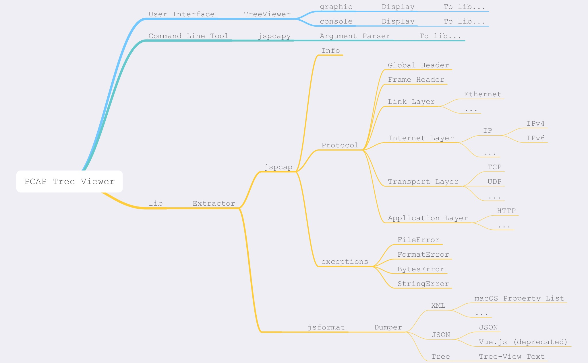
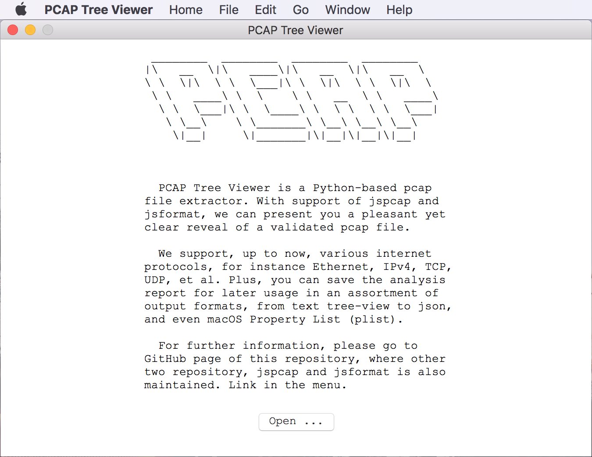
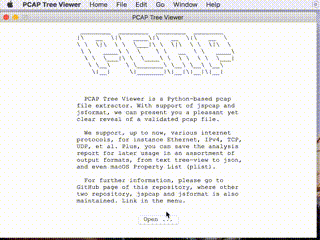
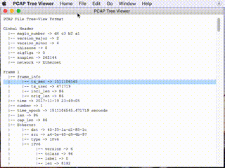
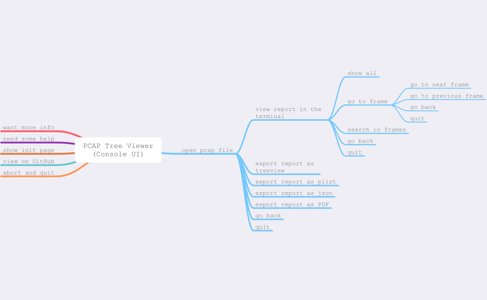
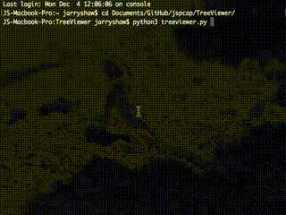
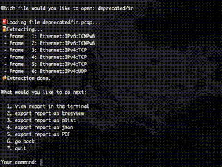
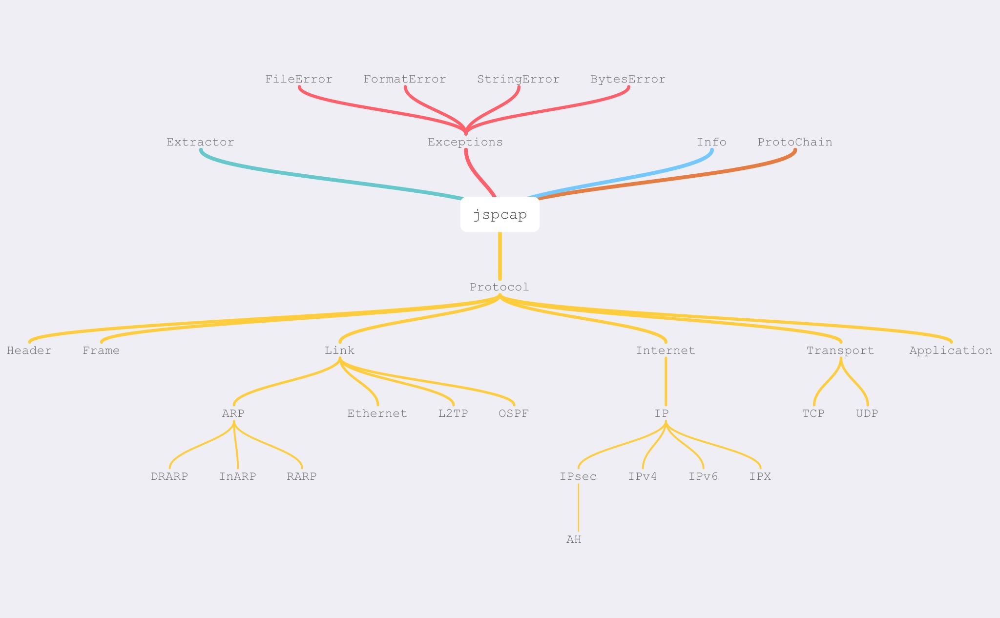
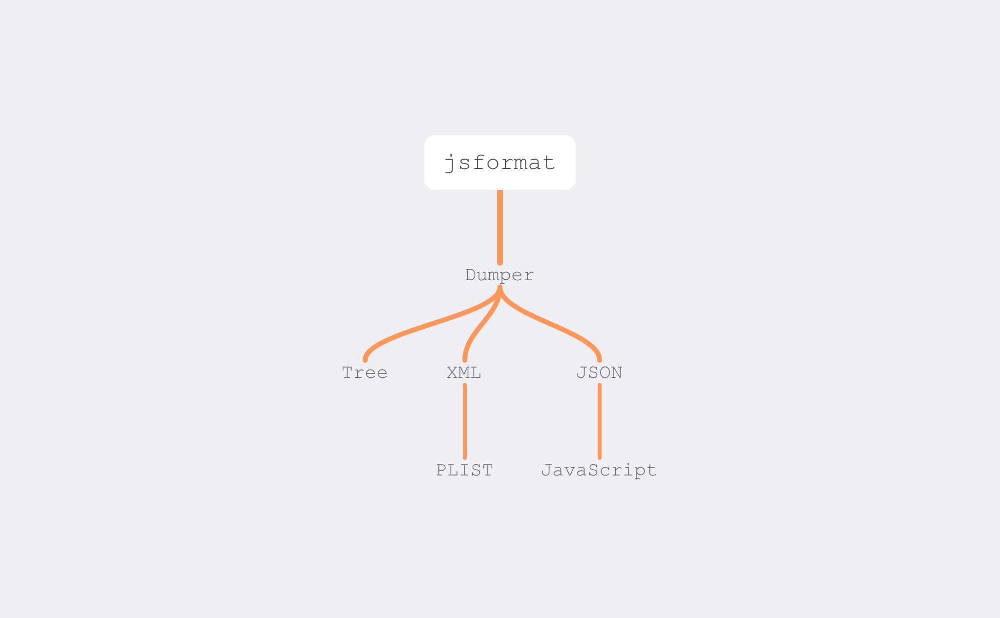

# 项目开发概要（设计）说明书

&nbsp;

##### 项目名称：PCAP 文件解析器（PCAP Tree Viewer）
##### 开发人员：肖佳伟（515030910023）

&nbsp;

## 简要概述

&emsp; &emsp; 在计算机网络管理领域中，PCAP（Packet CAPture）是一类用于捕获网络通信的应用程序编程接口，即 API。类 Unix 系统在 `libpcap` 中实现了此类接口，而 Windows 系统则使用一种名为 `WinPcap` 的 `libpcap` 接口封装。

&emsp; &emsp; 监控软件或使用 `libpcap` 和/或 `WinPcap` 来对网络中的数据流量进行抓取。而在新近的版本中，它们还能在链路层（link layer)网络传送数据包，以统计在当前环境下潜在的 `libpcap` 或 `WinPcap` 网络使用接口。

[备注]: 以上内容摘取并翻译自维基百科。

&emsp; &emsp; **PCAP Tree Viewer** 是一个基于 `Tkinter` 实现的应用，主要用于解析 [PCAP](https://en.wikipedia.org/wiki/Pcap) 数据包，并根据用户需求导出其他格式的文件。需要注意的是，本项目使用 **Python 3.6** 实现，不具备针对 Python 2.* 版本的后向兼容性，且并未检验其在 Python <3.6 版本中的兼容性。

&nbsp;

## 项目构想

 - 项目名称：PCAP 文件解析器（PCAP Tree Viewer）

 - 主要内容：
    * 读取 PCAP 文件，并解析数据包信息
    * 在命令行使用的文件解析工具
    * 易用的用户交互界面
    * 格式化输出

 - 模块分划：
     * 用户界面（UI）
        - 图形界面（Graphic UI）—— 基于 `Tkinter` 的图形用户界面
        - 交互界面（Console UI）—— 在终端使用的交互式用户界面
     * 辅助工具（Command Line Tool）—— 用于解析并输出的命令行工具
     * 依赖函数（Dependencies）
        - 解包工具（Extractor）—— 读取 PCAP 文件，并解析数据
        - 格式输出（Dumper）—— 依据一定格式输出文件

 - 预期功能：
    * 当系统依赖正常时，可使用图形界面进行交互；如出现异常，则可通过终端交互。
    * 可根据用户的选择，解析 PCAP 文件并从中提取网络数据包的信息，同时支持简易查找功能。
    * 根据用户需求，可将解析数据以特定格式输出。
    * 提供命令行工具，实现上述解析和导出的功能。

&nbsp;

## 项目实施

 - 开发进度
    * 10月中至10月底：查阅相关资料，确立设计
    * 10月底至11月中：基本完成 `jspcap` 和 `jsformat` 依赖库的开发
    * 11月中至11月底：设计并完成用户界面的开发和调试
    * 11月底至12月初：完成命令行工具的开发与调试
    * 12月初至12月中：项目综合调试与细节修改，撰写文档

 - 相关资料
    * [Python 标准库](https://docs.python.org/3.6/library/)
    * [`Tkinter` 文档](http://infohost.nmt.edu/tcc/help/pubs/tkinter/)
    * [RFC 文献](https://tools.ietf.org/)
    * 其他，如 StackOverflow、CSDN 及独立开发者博客等

&nbsp;

## 项目支持

 - 开发环境：macOS High Sierra (Version 10.13.2 Beta)

 - 软件系统：
    * Python 3.6.3
    * Pypy 3.5.3

 - 依赖工具：
    * 开发工具：
        - Atom 1.22.1 —— 代码编辑工具
        - Preview 10.0 —— macOS 原生应用，图形界面参考
        - `flake8` 3.5.0 —— `PEP8` 格式化代码工具
        - `git` 2.13.1 —— 版本控制工具
    * 软件依赖：
        - `pandoc` 2.0.3 —— 用于导出 PDF 文件功能的实现
            * `pdflatex` —— 导出 PDF 文件所需安装的 `pdf-engine` 依赖（可选）
        - `Tkinter` 8.5.9 —— 图形界面设计
        - `PyObjc` 4.0.1 —— 图形界面实现（仅针对 macOS 系统）
    * 其他工具：
        - Python 标准库
        - [ASCII Art](https://en.wikipedia.org/wiki/ASCII_art) 生成工具

 - 操作系统：
    * macOS
    * Windows（仅在 Windows 7 虚拟机上测试，图形界面或因机型而异）
    * Linux（图形界面或受硬件及设置等因素影响）

&nbsp;

## 项目设计

&emsp; &emsp; 如上文所述，**PCAP Tree Viewer** 项目可根据功能的不同和设计的区别，分为如下三大部分：

 - 用户界面（UI）
    * 图形界面（Graphic UI）—— `graphic.py`
    * 交互界面（Console UI）—— `console.py`
 - 辅助工具（Command Line Tool）—— `jspcapy.py`
 - 依赖函数（Dependencies）
    * 解包工具（Extractor）—— `jspcap/`
    * 格式输出（Dumper）—— `jsformat/`

其中，上述辅助工具和依赖函数可以通过 `pip` 或从 `GitHub` 下载源码安装，并作为第三方库使用。

##### 安装方法

 > &emsp; &emsp; 以下内容属于附加信息，助教小哥哥在检查的时候可以直接略过喔 (￣▽￣)

 1. 使用 `pip` 安装

    ```bash
    # 直接安装辅助工具，上述依赖函数将自动下载并安装
    # 如需安装辅助工具，则
    $ pip install jspcapy

    # 此外，jsformat 为 jspcap 的依赖
    # 如只需安装上述依赖函数，则
    $ pip install jspcap
    ```

 2. 使用源码安装

    ```bash
    $ git clone https://github.com/JarryShaw/jspcap.git

    # 如只需安装上述依赖函数，则
    $ cd jspcap/dev
    $ python setup.py install

    # 如需安装辅助工具，则
    $ cd jspcap/jspcapy
    $ python setup.py install
    ```

##### 安装依赖

&emsp; &emsp; 在项目中，除 Python 标准库外，还使用到了一些第三方库，或需要事先安装，特枚列如下：

 1. `pandoc` —— 如欲实现导出 PDF 文件的功能，则需安装

 2. `Tkinter` —— 必须安装，请根据操作系统安装

 3. `PyObjc` —— macOS系统安装，请使用如下代码进行安装或卸载

     ```bash
     # 安装
     $ pip install pyobjc

     # 卸载
     $ pip uninstall -y pyobjc pyobjc-core pyobjc-framework-Accounts pyobjc-framework-AddressBook pyobjc-framework-AppleScriptKit pyobjc-framework-AppleScriptObjC pyobjc-framework-ApplicationServices pyobjc-framework-Automator pyobjc-framework-AVFoundation pyobjc-framework-AVKit pyobjc-framework-CalendarStore pyobjc-framework-CFNetwork pyobjc-framework-CloudKit pyobjc-framework-Cocoa pyobjc-framework-Collaboration pyobjc-framework-ColorSync pyobjc-framework-Contacts pyobjc-framework-ContactsUI pyobjc-framework-CoreBluetooth pyobjc-framework-CoreData pyobjc-framework-CoreLocation pyobjc-framework-CoreML pyobjc-framework-CoreServices pyobjc-framework-CoreSpotlight pyobjc-framework-CoreText pyobjc-framework-CoreWLAN pyobjc-framework-CryptoTokenKit pyobjc-framework-DictionaryServices pyobjc-framework-DiskArbitration pyobjc-framework-EventKit pyobjc-framework-ExceptionHandling pyobjc-framework-ExternalAccessory pyobjc-framework-FinderSync pyobjc-framework-FSEvents pyobjc-framework-GameCenter pyobjc-framework-GameController pyobjc-framework-GameKit pyobjc-framework-GameplayKit pyobjc-framework-ImageCaptureCore pyobjc-framework-IMServicePlugIn pyobjc-framework-InputMethodKit pyobjc-framework-InstallerPlugins pyobjc-framework-InstantMessage pyobjc-framework-Intents pyobjc-framework-IOSurface pyobjc-framework-iTunesLibrary pyobjc-framework-LatentSemanticMapping pyobjc-framework-LaunchServices pyobjc-framework-LocalAuthentication pyobjc-framework-MapKit pyobjc-framework-MediaAccessibility pyobjc-framework-MediaLibrary pyobjc-framework-MediaPlayer pyobjc-framework-ModelIO pyobjc-framework-MultipeerConnectivity pyobjc-framework-NetFS pyobjc-framework-NetworkExtension pyobjc-framework-NotificationCenter pyobjc-framework-OpenDirectory pyobjc-framework-Photos pyobjc-framework-PhotosUI pyobjc-framework-PreferencePanes pyobjc-framework-PubSub pyobjc-framework-QTKit pyobjc-framework-Quartz pyobjc-framework-SafariServices pyobjc-framework-SceneKit pyobjc-framework-ScreenSaver pyobjc-framework-ScriptingBridge pyobjc-framework-SearchKit pyobjc-framework-ServiceManagement pyobjc-framework-Social pyobjc-framework-SpriteKit pyobjc-framework-StoreKit pyobjc-framework-SyncServices pyobjc-framework-SystemConfiguration pyobjc-framework-Vision pyobjc-framework-WebKit
     ```

##### 工作流程

&emsp; &emsp; 为便于更直观的了解项目格式，可将项目调用逻辑及其工作流程表示如下：



&nbsp;

### 用户界面（UI）

#### 图形界面（Graphic UI）

 > 此部分功能在 `graphic.py` 中实现。

&emsp; &emsp; **PCAP Tree Viewer** 的图形界面基于 `Tkinter` 库实现。其界面采取 ASCII 画风，追求简洁明了，而菜单栏的设计则仿照 macOS 平台的原生应用。但需要指出的是，由于缺少系统层面 API 的调用权限，其中的部分功能暂未实现。



##### 菜单

&emsp; &emsp; 菜单栏模仿了 macOS 平台原生应用 Preview 的菜单设计，其具体结构如下所示：

```
    PCAP Tree Viewer | Home (macOS)
        * About PCAP Tree Viewer
        * Preferences...                          ⌘,
        * Service
            - No Services Apply (disabled)
            - System Preferences...
        -----------------------------------------------
        * Hide PCAP Tree Viewer                   ⌘H
        * Hide Others                            ⌥⌘H
        * Show All
        -----------------------------------------------
        * Quit PCAP Tree Viewer                   ⌘Q

    File
        * Open...                                 ⌘O
        * Open Recent
            * Recent File 0
            * Recent File 1
            * ......
            -------------------------------------------
            * Clear Menu
        * Close Window                            ⌘W
        * Save                                    ⌘S
        * Duplicate                              ⇧⌘S
        * Rename...
        * Move To...
        * Export...
        * Export as PDF...
        -----------------------------------------------
        * Print                                   ⌘P

    Edit
        * Copy                                    ⌘C
        * Select All                              ⌘A
        * Invert Selection                       ⇧⌘I
        -----------------------------------------------
        * Move to Trash                           ⌘⌫
        -----------------------------------------------
        * Find
            * Find...                             ⌘F
            * Find Next                           ⌘G
            * Find Previous                      ⇧⌘G
            * Use Selection for Find              ⌘E
            * Jump to Selection                   ⌘J

    Go
        * Up                                       ↑
        * Down                                     ↓
        * Previous Frame                          ⌥↑
        * Next Frame                              ⌥↓
        * Go to Frame...                         ⌥⌘G
        -----------------------------------------------
        * Back                                    ⌘[
        * Forward                                 ⌘]

    Window
        * Minimise                                ⌘M
        * Zoom

    Help
        * Search
        -----------------------------------------------
        * PCAP Tree Viewer Help
        * View on GitHub

```

&emsp; &emsp; 由于 `Tkinter` 在 macOS 平台上需要调用 Python 内置的 `Python.app` 才能正常工作，因此必然在菜单栏出现默认的 `Python` 主菜单。通过 `PyObjc` 库中的 `Foundation.NSBundle` 可对其 `info.plist` 文件中的应用名称进行修改，使得菜单首栏显示为 `PCAP Tree Viewer`，但并不能通过 `Tkinter` 提供的 API 修改下拉菜单的内容。

##### 显示界面

&emsp; &emsp; 在点击 `Open...` 或唤起菜单栏中 `File -> Open...` 选项后，选择 PCAP 文件，亦可从 `File -> Open Recent -> ...` 中选择此前曾打开过的文件。如果选择的文件类型错误，将会提示错误信息；反之，可进入如下解析并加载界面：



随后，根据用户需求，可选择高亮（最小单位为行）、查询、拷贝等常见操作，包括跳转至某一数据帧处的功能，即 `Go -> Go to Frame...`。

&emsp; &emsp; 在查阅完成后，还可将解析报告导出为 `plist`、`json`和如 UI 中显示的树状文本格式。在点击 `File -> Export... -> ...` 后，进入如下导出界面：



而这种树状的表现形式灵感来自于 macOS 原生应用 Xcode 对 `*.plist` 文件的特殊优化显示和 JavaScript 框架 `Vue.js` 中的 `TreeView` 显示。同时，程序还支持导出 PDF 格式文件，但需要使用著名开源格式转换工具 `pandoc`。

&emsp; &emsp; 需要说明的是，有一部分功能由于能力未及，并未实现——如根据程序当前状态，禁用部分菜单栏的功能（作为鲁棒性补偿，当前 UI 将在错误使用时提示错误信息）。此外，在 `Help` 栏中，macOS 系统内置了查询帮助功能，即 `Help -> Search`，故为保持各系统 UI 外观一致，在非 macOS 系统的菜单中也添加了这一选项，但并未实现。

##### 其他

&emsp; &emsp; 为了增强程序的可用性，在 `src/` 文件夹中还有相关信息、使用帮助等文件。这些内容，通过图形界面均可访问并查看。另外，在菜单栏中，`Help -> View on GitHub` 选项还提供了打开浏览器，并跳转本项目 [repo](https://github.com/JarryShaw/jspcap/) 的功能。

&emsp; &emsp; 如上所述，图形界面仍留有少数功能未能实现。而笔者目前正在研究如何利用 `PyObjc` 库、`py2app` 转换包装和 `xib` 图形界面标记格式，使用 Python 在 macOS 平台上编写原生应用程序。

&nbsp;

#### 交互界面（Console UI）

 > 此部分功能在 `console.py` 中实现。

&emsp; &emsp; 当图形界面中出现 `ImportError` 时，**PCAP Tree Viewer** 的用户界面将以命令行呈现。其保留了图形界面中的主要功能，包括打开并解析文件，查阅解析报告并支持简单查询，以及将解析报告格式化导出。其主要逻辑流程如下：



&emsp; &emsp; 根据终端给出的指令提示信息，用户输入指令**编号**即可执行。如指令输入错误，则将返回错误提示信息；如为退出指令，即 `q`、`quit` 或 `exit`，则将终止程序运行。

&emsp; &emsp; 此外，在终端中运行时，程序还将提供类似图形界面的数据和信息，如在打开文件的过程中，将有如下显示：



从图中可见，数据帧编号及其协议类型将在解析的过程中同时被显示。而在导出解析报告的过程中，又有如下信息：



&emsp; &emsp; 需要指出的是，在代码实现的过程中，笔者意外发现 Python 标准库中提供了一个名为 `curses` 的库，可用其在终端中绘制图形界面。考虑到能力未及，因而并未深入尝试。

&nbsp;

### 辅助工具（Command Line Tool）

 > 此部分功能在 `jspcapy.py` 中实现。

&emsp; &emsp; 在 **PCAP Tree Viewer**  中，还有一个较为基础但十分实用的功能 ——`jspcapy`。`jspcapy` 是用于 PCAP 文件解析并导出的分析工具，可视为上述图形界面的原初版本。

&emsp; &emsp; 如其帮助中所显示的，这一工具的使用并不复杂：

```bash
# 直接测试时，请使用 `python3 jspcapy -h`，下同
$ jspcapy -h
usage: jspcapy.py [-h] [-v] [-o file-name] [-f format] [-j] [-p] [-t] [-a]
                  [-V]
                  input-file-name

PCAP file extractor and formatted exporter

positional arguments:
  input-file-name       The name of input pcap file. If ".pcap" omits, it will
                        be automatically appended.

optional arguments:
  -h, --help            show this help message and exit
  -v, --version         show program version number and exit
  -o file-name, --output file-name
                        The name of input pcap file. If format extension
                        omits, it will be automatically appended.
  -f format, --format format
                        Print a extraction report in the specified output
                        format. Available are all formats supported by
                        jsformat, e.g.: json, plist, tree, xml, html.
  -j, --json            Display extraction report as json. This will yield
                        "raw" output that may be used by external tools. This
                        option overrides all other options.
  -p, --plist           Display extraction report as macOS Property List
                        (plist). This will yield "raw" output that may be used
                        by external tools. This option overrides all other
                        options.
  -t, --tree            Display extraction report as tree view text. This will
                        yield "raw" output that may be used by external tools.
                        This option overrides all other options.
  -a, --auto-extension  If output file extension omits, append automatically.
  -V, --verbose         Show more information.
```

&emsp; &emsp; 在使用时，需指定输入文件（其中文件后缀可以省略），若已指定输出格式，如`json`、`plist`、`tree`、`xml`或`html`，则输出文件的后缀名或其本身可以省略；反之，则需在输出文件名中指明后缀， 如`*.json`、`*.plist`、`*.txt`、`*.xml`或`*.js`。否则，将提示 `FormatError` 错误信息。

&emsp; &emsp; 至于 `verbose` 模式，详细的输出信息将被显示（以下示例均以此模式运行）。而使用 `auto-extension` 则表明输出文件将自动补全相应后缀名。

 - 导出 `plist` 格式的解析报告

 ```bash
 $ jspcapy in -f plist -V
 🚨Loading file 'in.pcap'
  - Frame   1: Ethernet:IPv6:ICMPv6
  - Frame   2: Ethernet:IPv6:ICMPv6
  - Frame   3: Ethernet:IPv4:TCP
  - Frame   4: Ethernet:IPv4:TCP
  - Frame   5: Ethernet:IPv4:TCP
  - Frame   6: Ethernet:IPv4:UDP
 🍺Report file stored in 'out.plist'
 ```

 - 导出名称为 `out.json` 的解析报告

 ```bash
 $ jspcapy in -o out.json -V
 🚨Loading file 'in.pcap'
 - Frame   1: Ethernet:IPv6:ICMPv6
 - Frame   2: Ethernet:IPv6:ICMPv6
 - Frame   3: Ethernet:IPv4:TCP
 - Frame   4: Ethernet:IPv4:TCP
 - Frame   5: Ethernet:IPv4:TCP
 - Frame   6: Ethernet:IPv4:UDP
🍺Report file stored in 'out.json'
 ```

 - 导出名为 `out` 格式为 `tree` 且后缀名自动补全的解析报告

 ```bash
 $ jspcapy in -o out -f tree -a -V
 🚨Loading file 'in.pcap'
 - Frame   1: Ethernet:IPv6:ICMPv6
 - Frame   2: Ethernet:IPv6:ICMPv6
 - Frame   3: Ethernet:IPv4:TCP
 - Frame   4: Ethernet:IPv4:TCP
 - Frame   5: Ethernet:IPv4:TCP
 - Frame   6: Ethernet:IPv4:UDP
🍺Report file stored in 'out.txt'
 ```

&nbsp;

### 依赖函数（Dependencies）

#### 解包工具（Extractor）

 > 此部分功能在 `jspcap/` 中实现。

&emsp; &emsp; &emsp; &emsp; 独立开发库 `jspcap` 是本项目的核心之一，为解析 PCAP 文件的依赖库。其并未使用任何第三方库，也并未参照主流解包工具，如 `Scapy`、`dkpt` 和 `pyshark` 等。

&emsp; &emsp; `jspcap` 采取了**流式读取**的策略，即逐段读入文件，减少对内存空间的占用，同时从某种程度上提高了解析效率。在 `jspcap` 库中，各文件主要可视为如下五个部分：

 - 解析算法，即 `Extraction` —— 综合文件读写与协议解析，协调网络各层级的信息读取等（这一部分在本项目并未使用）

 - 重组算法，即 `Reassembly` —— 基于 [`RFC 815`](https://tools.ietf.org/html/rfc815) 中所描述的算法，实现对 TCP 应用层报文的重组，以及 IP 包的分片重组

 - 根协议，即 `Protocol` —— 抽象协议，包含协议类应有的常用函数和属性，并指定抽象方法等

 - 协议族 —— 通过根协议派生，根据协议的具体结构实现的具体解析方案等

 - 异常类 —— 异常处理，根据异常情况抛出并显示异常信息等

&emsp; &emsp; 各部分内容的派生逻辑如下图所示：



##### 解析算法

&emsp; &emsp; 本部分采取了**流式读取**的策略，即逐段读入文件，减少对内存空间的占用，同时从某种程度上提高了解析效率。在实现上，以 PCAP 文件中的 `Frame` 为单位，通过在各层协议间传递 `io.BytesIO` 的形式进行流式读取。

&emsp; &emsp; 头文件，特指在 `jspcap/extractor.py` 中实现的 `Extractor` 类。其负责处理文件名称的补全 —— 如输入文件名缺省后缀 `.pcap`，则需添加；如未指定输出类型，则通过输出文件名指明类型，若否则返回 `FormatError` 错误提示；如未指定输出文件名称，则默认为 `out`（见类方法 `make_name`）—— 以及根据 PCAP 文件的 `Global Header` 中指定的链路层协议类型，调取对 `Frame` 的解析操作，并返回解析结果；最终，记录必要信息，便于在如 UI 中交互调用，及后续协议拼接重组操作。

&emsp; &emsp; 此外，`Extractor` 类支持自动解析，或迭代解析两种模式。以基于`jspcap` 实现的命令行工具 [`jspcapy`](https://github.com/JarryShaw/jspcap/tree/master/jspcapy) 的使用为例， `verbose` 模式下为迭代解析，从而可获取每一数据帧的信息；而自动模式则为自动解析，直接完成解析过程，并输出文件。

##### 重组算法

&emsp; &emsp; 本部分参考了 [`RFC 791`](https://tools.ietf.org/html/rfc791) 和 [`RFC 815`](https://tools.ietf.org/html/rfc815) 中描述的两种算法。前者详细描述了 IP 包分片及重组的算法实现，其中使用到了 `RCVBT`，即“已接收比特哈希表”来维护接收顺序；而后者则针对上述 `RCVBT` 进行了优化，提出了一种替代算法。

&emsp; &emsp; 为了便于算法的实现和使用，此处首先在 `jspcap/reassembly/reassembly.py` 中声明了一个名为 `Reassembly` 的抽象基类（Abstract Base Class），其效果等同于根协议。其中指定了一些抽象属性，如 `name`、`count` 和 `datagram` 等；一些抽象函数，如 `reassembly` 和 `submit`，分别用于重组过程和重组完成后提取结果；以及一些工具函数。

&emsp; &emsp; 需要指出的是，同解析算法中的 `Extractor` 一样，此处也提供两种模式，可通过 `run` 方法完成多个数据包的重组；或通过直接调用，即 `__call__` 方法，逐次输入进行重组。

###### IP 分片重组

&emsp; &emsp; 由于操作内存占用较小，故 IP 包的分片重组直接采用了 [`RFC 791`](https://tools.ietf.org/html/rfc791) 的原始算法。其算法伪代码表示如下：

```
Notation:
    FO    - Fragment Offset
    IHL   - Internet Header Length
    MF    - More Fragments flag
    TTL   - Time To Live
    NFB   - Number of Fragment Blocks
    TL    - Total Length
    TDL   - Total Data Length
    BUFID - Buffer Identifier
    RCVBT - Fragment Received Bit Table
    TLB   - Timer Lower Bound

Procedure:
    DO {
        BUFID <- source|destination|protocol|identification;

        IF (FO = 0 AND MF = 0) {
            IF (buffer with BUFID is allocated) {
                flush all reassembly for this BUFID;
                Submit datagram to next step;
                DONE.
            }
        }

        IF (no buffer with BUFID is allocated) {
            allocate reassembly resources with BUFID;
            TIMER <- TLB;
            TDL <- 0;
            put data from fragment into data buffer with BUFID
                [from octet FO*8 to octet (TL-(IHL*4))+FO*8];
            set RCVBT bits [from FO to FO+((TL-(IHL*4)+7)/8)];
        }

        IF (MF = 0) {
            TDL <- TL-(IHL*4)+(FO*8)
        }

        IF (FO = 0) {
            put header in header buffer
        }

        IF (TDL # 0 AND all RCVBT bits [from 0 to (TDL+7)/8] are set) {
            TL <- TDL+(IHL*4)
            Submit datagram to next step;
            free all reassembly resources for this BUFID;
            DONE.
        }

        TIMER <- MAX(TIMER,TTL);

    } give up until (next fragment or timer expires);

    timer expires: {
        flush all reassembly with this BUFID;
        DONE.
    }
```

&emsp; &emsp; 其中，特别对算法中使用的报文数据缓冲区 `buffer` 的数据结构描述如下：

```python
(dict) buffer --> memory buffer for reassembly
    |--> (tuple) BUFID : (dict)
    |     |--> ip.src     |
    |     |--> ip.dst     |
    |     |--> ip.id      |
    |     |--> ip.proto   |
    |                     |--> 'TDL' : (int) total data length
    |                     |--> RCVBT : (bytearray) fragment received bit table
    |                     |               |--> (bytes) b'\x00' not received
    |                     |               |--> (bytes) b'\x01' received
    |                     |               |--> (bytes) ...
    |                     |--> 'index' : (list) list of reassembled packets
    |                     |               |--> (int) packet range number
    |                     |--> 'header' : (bytearray) header buffer
    |                     |--> 'datagram' : (bytearray) data buffer, holes set to b'\x00'
    |--> (tuple) BUFID ...
```

####### IPv4

&emsp; &emsp; 针对上述算法，以下将大致解释 IPv4 分片重组的使用方法和符号意义。

```python
>>> from reassembly import IPv4_Reassembly
# Initialise instance:
>>> ipv4_reassembly = IPv4_Reassembly()
# Call reassembly:
>>> packet_dict = dict(
...     bufid = tuple(
...         ipv4.src,           # source IP address
...         ipv4.dst,           # destination IP address
...         ipv4.id,            # identification
...         ipv4.proto,         # payload protocol type
...     ),
...     num = frame.number,     # original packet range number
...     fo = ipv4.frag_offset,  # fragment offset
...     ihl = ipv4.hdr_len,     # internet header length
...     mf = ipv4.flags.mf,     # more fragment flag
...     tl = ipv4.len,          # total length, header includes
...     header = ipv4.header,   # raw bytearray type header
...     payload = ipv4.payload, # raw bytearray type payload
... )
>>> ipv4_reassembly(packet_dict)
# Fetch result:
>>> result = ipv4_reassembly.datagram

(tuple) datagram
    |--> (Info) data
    |     |--> 'NotImplemented' : (bool) True --> implemented
    |     |--> 'index' : (tuple) packet numbers
    |     |                 |--> (int) original packet range number
    |     |--> 'packet' : (bytes/None) reassembled IPv4 packet
    |--> (Info) data
    |     |--> 'NotImplemented' : (bool) False --> not implemented
    |     |--> 'index' : (tuple) packet numbers
    |     |                 |--> (int) original packet range number
    |     |--> 'header' : (bytes/None) IPv4 header
    |     |--> 'payload' : (tuple/None) partially reassembled IPv4 payload
    |                       |--> (bytes/None) IPv4 payload fragment
    |--> (Info) data ...
```

####### IPv6

&emsp; &emsp; 针对上述算法，以下将大致解释 IPv6 分片重组的使用方法和符号意义。

```python
>>> from reassembly import IPv6_Reassembly
# Initialise instance:
>>> ipv6_reassembly = IPv6_Reassembly()
# Call reassembly:
>>> packet_dict = dict(
...     bufid = tuple(
...         ipv6.src,           # source IP address
...         ipv6.dst,           # destination IP address
...         ipv6.label,         # label
...         ipv6_frag.next,     # next header field in IPv6 Fragment Header
...     ),
...     num = frame.number,     # original packet range number
...     fo = ipv6_frag.offset,  # fragment offset
...     ihl = ipv6.hdr_len,     # header length, only headers before IPv6-Frag
...     mf = ipv6_frag.mf,      # more fragment flag
...     tl = ipv6.len,          # total length, header includes
...     header = ipv6.header,   # raw bytearray type header before IPv6-Frag
...     payload = ipv6.payload, # raw bytearray type payload after IPv6-Frag
... )
>>> ipv6_reassembly(packet_dict)
# Fetch result:
>>> result = ipv6_reassembly.datagram

(tuple) datagram
    |--> (Info) data
    |       |--> 'NotImplemented' : (bool) True --> implemented
    |       |--> 'index' : (tuple) packet numbers
    |       |                 |--> (int) original packet range number
    |       |--> 'packet' : (bytes/None) reassembled IPv6 packet
    |--> (Info) data
    |       |--> 'NotImplemented' : (bool) False --> not implemented
    |       |--> 'index' : (tuple) packet numbers
    |       |                 |--> (int) original packet range number
    |       |--> 'header' : (bytes/None) IPv6 header
    |       |--> 'payload' : (tuple/None) partially reassembled IPv6 payload
    |                         |--> (bytes/None) IPv6 payload fragment
    |--> (Info) data ...
```

###### TCP 报文重组

&emsp; &emsp; TCP 报文重组采用了 [`RFC 815`](https://tools.ietf.org/html/rfc815) 中描述的对 `RCVBT` 进行优化后的算法。其重组算法同上述 IP 分片重组，而“已接收比特哈希表”的替代算法过程描述如下：

 1. 从孔隙表中选取下一空隙。如孔隙表为空，则执行第八步操作。
 2. 如果片段首部（`fragment.first`）大于孔隙尾部（`hole.last`），则执行第一步操作。
 3. 如果片段尾部（`fragment.last`）小于孔隙首部（`hole.first`），则执行第一步操作。
 4. 从孔隙表中删除当前孔隙。
 5. 如果片段首部（`fragment.first`）大于孔隙首部（`hole.first`），则创建新孔隙 `new_hole`，令其首部（`new_hole.first`）等于原孔隙首部（`hole.first`），其尾部等于片段首部（`fragment.first`）减一。
 6. 如果片段尾部（`fragment.last`）大于孔隙尾部（`hole.last`），且更多片段标签（`fragment.more_fragments`）为真，则创建新孔隙 `new_hole`，令其首部（`new_hole.first`）等于片段尾部（`fragment.last`）加一，其尾部等于原孔隙尾部（`hole.last`）。
 7. 执行第一步操作。
 8. 如果孔隙表为空，则报文已重组完成。将其传递至高层协议处理机制。否则，返回。

&emsp; &emsp; 其中，特别对算法中使用的报文数据缓冲区 `buffer` 的数据结构描述如下：

```python
(dict) buffer --> memory buffer for reassembly
    |--> (tuple) BUFID : (dict)
    |     |--> ip.src      |
    |     |--> ip.dst      |
    |     |--> tcp.secport |
    |     |--> tcp.dstport |
    |                      |--> 'hdl' : (list) hole descriptor list
    |                      |                 |--> (Info) hole --> hole descriptor
    |                      |                       |--> "first" --> (int) start of hole
    |                      |                       |--> "last" --> (int) stop of hole
    |                      |--> (int) ACK : (dict)
    |                      |                 |--> 'ind' : (list) list of reassembled packets
    |                      |                 |             |--> (int) packet range number
    |                      |                 |--> 'isn' : (int) ISN of payload buffer
    |                      |                 |--> 'len' : (int) length of payload buffer
    |                      |                 |--> 'raw' : (bytearray) reassembled payload,
    |                      |                               holes set to b'\x00'
    |                      |--> (int) ACK ...
    |                      |--> ...
    |--> (tuple) BUFID ...
```

&emsp; &emsp; 针对上述算法，以下将大致解释 TCP 报文重组的使用方法和符号意义。

```python
>>> from reassembly import TCP_Reassembly
# Initialise instance:
>>> tcp_reassembly = TCP_Reassembly()
# Call reassembly:
>>> packet_dict = dict(
...     bufid = tuple(
...         ip.src,                     # source IP address
...         ip.dst,                     # destination IP address
...         tcp.srcport,                # source port
...         tcp.dstport,                # destination port
...     ),
...     num = frame.number,             # original packet range number
...     ack = tcp.ack,                  # acknowledgement
...     dsn = tcp.seq,                  # data sequence number
...     syn = tcp.flags.syn,            # synchronise flag
...     fin = tcp.flags.fin,            # finish flag
...     len = tcp.raw_len,              # payload length, header excludes
...     first = tcp.seq,                # this sequence number
...     last = tcp.seq + tcp.raw_len,   # next (wanted) sequence number
...     payload = tcp.raw,              # raw bytearray type payload
... )
>>> tcp_reassembly(packet_dict)
# Fetch result:
>>> result = tcp_reassembly.datagram

(tuple) datagram
    |--> (Info) data
    |     |--> 'NotImplemented' : (bool) True --> implemented
    |     |--> 'index' : (tuple) packet numbers
    |     |                 |--> (int) original packet range number
    |     |--> 'payload' : (bytes/None) reassembled application layer data
    |--> (Info) data
    |     |--> 'NotImplemented' : (bool) False --> not implemented
    |     |--> 'index' : (tuple) packet numbers
    |     |                 |--> (int) original packet range number
    |     |--> 'payload' : (tuple/None) partially reassembled payload
    |                       |--> (bytes/None) payload fragment
    |--> (Info) data ...
```

##### 根协议

&emsp; &emsp; 根协议，特指在 `jspcap/protocols/protocol.py` 中实现的 `Protocol` 类。其为一抽象基类（Abstract Base Class），定义了在协议族中需要用到一些通用方法，如 `unpack`、`binary` 和 `read` 等。此外，还指定了一些抽象属性，需要在协议族中重载，如 `name`、`info` 和 `length` 等。

&emsp; &emsp; 需要指出的是，在 `jspcap/protocols/utilities.py` 文件中，定义了用于在不干预原有文件读取指针情况下，对文件进行操作的 `seekset` 函数，其通常以装饰器的形式进行使用。同时，定义了 `ProtoChain` 类。其用于保存当前协议的协议链，使得在协议层的传递过程中，得以清晰和便捷地保留并获取上层及下层协议信息。

&emsp; &emsp; 此外，上述文件中，还定义了 `Info` 类，用于将字典参数（`dict`）转化为对象属性的类，便于在协议层中传递并读取和使用。

```python
# 字典对象，及其访问
>>> dict_ = dict(
...     foo = 'foo_arg',
...     bar = 'bar_arg',
...     baz = 'baz_arg',
... )
>>> dict_
{'foo': 'foo_arg', 'bar': 'bar_arg', 'baz': 'baz_arg'}
>>> dict_['foo']
'foo_arg'

# Info 对象，及其访问
>>> info = Info(dict_)
>>> info
Info(foo='foo_arg', bar='bar_arg', baz='baz_arg')
>>> info.foo
'foo_arg'
```

##### 协议族

&emsp; &emsp; 协议族，指包含 PCAP 文件特有的 `Global Header` 和 `Frame Header` 以及计算机网络 TCP/IP 四层架构在内的所有协议，在 `jspcap/protocols/` 中实现。但由于能力和时间所限，目前仅完成了链路层 Ethernet 等，网络层 IPv4 和 IPv6 等，及传输层 TCP 和 UDP 等的解析。

&emsp; &emsp; 其中，PCAP 文件的 `Global Header` 在 `jspcap/protocols/header.py` 中的 `Header` 类实现，而 `Frame Header` 则在 `jspcap/protocols/frame.py` 中的 `Frame` 类实现。

&emsp; &emsp; 通过根协议 `Protocol`，派生得到各层级的副根协议，即

 - 链路层 —— `jspcap/protocols/link/link.py` 中的 `Link` 类
 - 网络层 —— `jspcap/protocols/internet/internet.py` 中的 `Internet` 类
 - 传输层 —— `jspcap/protocols/transport/transport.py` 中的 `Transport` 类
 - 应用层 —— `jspcap/protocols/application/application.py` 中的 `Application` 类（暂未实现）

除此之外，上述文件中还定义有在 IANA 注册的协议编号表，即 `LINKTYPE`、`ETHERTYPE` 和 `TP_PROTO`。同时，在这些副根协议中，重载并实现了对下一层协议的导入和解析。

&emsp; &emsp; 随后，基于各层级的副根协议，派生了各层级特定协议的具体实现，详细内容在此不做赘述。需要指出的是，其中部分暂未实现或完成的协议，均被置于 `jspcap/protocols/*/NotImplemented/` 中。

&emsp; &emsp; 此外，在 TCP 协议头中有 `options` 区域。程序专门设计了简易明了的数据结构加以分析处理，在代码 `transport/tcp.py` 中有详细的注释和说明。但由于时间仓促，因此暂未实现对 IPv4 中 `options` 区域的解析。

&emsp; &emsp; 由于 `jspcap` 采取了**流式读取**的策略，在协议族中数据帧以 `io.BytesIO` 的形式传递，内存占用极小。但这使其变为 IO 密集型程序，后期或考虑协程（coroutine）进行优化。

##### 异常类

&emsp; &emsp; 异常类，特指在 `jspcap/exceptions.py` 中声明的异常。这些异常由 `BaseException` 派生，是为用户定制异常。笔者曾在 [`jsntlib`](https://github.com/JarryShaw/jsntlib) 的开发中探讨过如何定制化异常信息，但此处并无此需求，故略去。

#### 格式输出（Dumper）

 > 此部分功能在 `jsformat/` 中实现。

&emsp; &emsp; 独立开发库 `jsformat` 是本项目的另一核心，为格式化输出的依赖库。在 Python 标准库中有 `plist` 和 `json` 等格式化输出库，但并未支持流式输出，当输出内容过多时，将对内存产生极大负荷。因此，`jsformat` 即是为此而生。

&emsp; &emsp; 如上文所述，`jsformat` 采取了流式输出的策略，即维护一输出对象实例，从而逐步输出文件，减少对内存空间的占用。目前，其支持下列五种文件格式：

 - `json`，即 JavaScript Object Notation 格式输出

 - `plist`，即 [macOS Property List](https://developer.apple.com/library/content/documentation/Cocoa/Conceptual/PropertyLists/AboutPropertyLists/AboutPropertyLists.html/) 格式输出

 - `tree`，即树形文本输出，如图形界面所示

 - `html`，用于 `Vue.js` 的输出，已弃用

 - `xml`，普通的 `XML` 输出，无 `dtd` 指定，未启用

&emsp; &emsp; 需要指出的是，`jsformat` 中亦使用了抽象基类来对代码实现进行精简和优化，具体派生逻辑如下图所示：



&emsp; &emsp; 同 `jspcap` 所存在的问题，`jsformat` 采取了**流式输出**的策略，在头文件中文件指针以 `io.FileIO` 的形式传递，内存占用极小。但这使其变为 IO 密集型程序，后期或考虑协程（coroutine）进行优化。

&nbsp;

## 项目总结

&emsp; &emsp; 作为一位来自电院的“刷分狗”，完成这个项目之后熟悉 Python 之类的也就不必说了。不过，该装的逼还是要有的 —— 完成这个项目之后，除去 web 开发与 C 延拓，Python 中的主要特性也就只有多线程 `threading` 和协程 `asyncio` 没有涉足过了。

&emsp; &emsp; 在前文中也曾提及，该项目尚有五处亟待优化的地方：

 - 通过 `PyObjc` 和 `py2app` 开发 macOS 平台原生应用

 - 尝试 `curses` 设计终端图形交互界面

 - 使用 `asyncio` 优化 `jspcap` 和 `jsformat` 的 IO 密集问题

 - 完善 `jspcap` 以支持更多的网络协议

 - 拓展 `jsformat` 使之可以导出更多的文件格式

此外，在图形界面中还需解决菜单的状态切换，以替代当前的状态检查。更多的信息，可以在本项目的 [repo](https://github.com/JarryShaw/jspcap) 查看。
